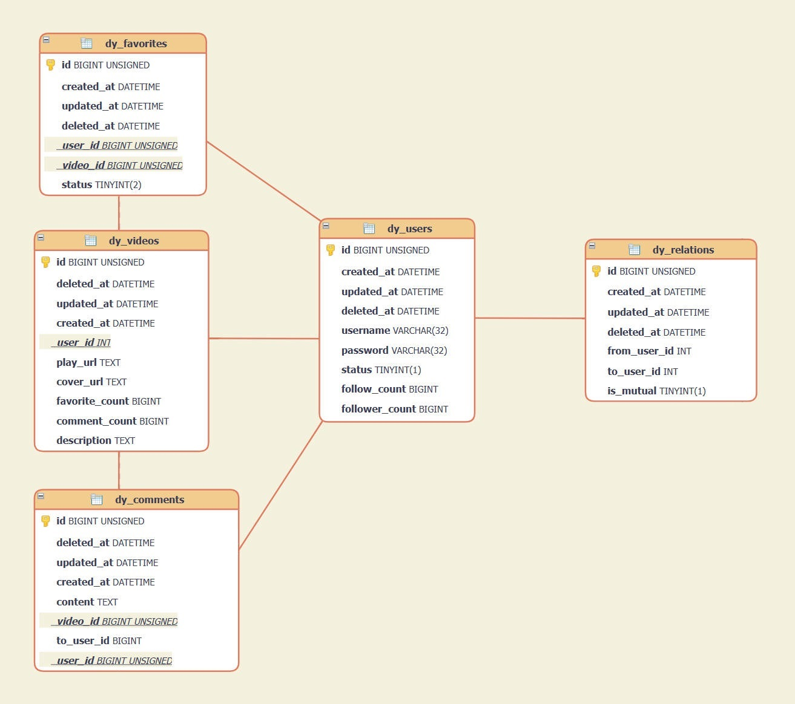

# SimpleDouyin

<!-- LOGO -->
<div align="center">
  
<a href="https://github.com/zheng-yi-yi/SimpleDouyin/">
  
</a>

</br>

<!-- shields -->


<strong>简体中文</strong> | [English](README_EN.md)


</div>


# 项目介绍

这是一个基于 Golang 编写的短视频分享平台的服务端。它涵盖了多个功能模块，包括身份验证、视频管理、评论、点赞、关注等，以支持用户之间的互动和内容分享。

> ### 模块概述：
> 
> - `User` 模块： 处理用户相关的逻辑，包括用户注册、用户登录、获取用户信息等。
> - `Video` 模块： 处理视频相关的逻辑，包括视频发布、获取视频 `Feed`、获取用户发布的视频列表、获取视频信息等。
> - `Comment` 模块： 处理评论相关的逻辑，可以发布、删除、获取视频的评论列表等。
> - `Favorite` 模块： 处理点赞相关的逻辑，包括点赞、取消点赞、获取用户点赞视频列表等。
> - `Relation` 模块： 处理用户关系（关注）相关的逻辑，包括关注、取消关注、获取关注者列表、获取粉丝列表等。

项目使用了 `Gin` 框架来构建 `HTTP` 服务器和定义路由。通过不同的路由处理函数，实现了用户注册、登录、发布视频、点赞、关注、评论等功能。 同时使用 `MySQL` 数据库进行数据存储，通过 `GORM` 作为 `ORM` 库来进行数据库操作。


# 技术栈

<table>
    <tr>
        <th>分类</th>
        <th>名称</th>
        <th>描述</th>
    </tr>
    <tr>
        <td>编程语言</td>
        <td><a href="https://go.dev/doc/">Go</a></td>
        <td>静态强类型、编译型、并发型，并具有垃圾回收功能的编程语言。</td>
    </tr>
    <tr>
        <td>框架</td>
        <td><a href="https://gin-gonic.com/docs/">Gin</a></td>
        <td>轻量级的 <code>Web</code> 框架，用于构建高性能的 <code>HTTP</code> 服务。</td>
    </tr>
    <tr>
        <td>框架</td>
        <td><a href="https://gorm.io/docs/">Gorm</a></td>
        <td>基于 <code>Go</code> 语言的对象关系映射（<code>ORM</code>）库，用于与数据库进行交互。</td>
    </tr>
    <tr>
        <td>数据库</td>
        <td><a href="https://dev.mysql.com/doc/">MySQL</a></td>
        <td>开源的关系型数据库管理系统，用于存储和管理项目的数据。</td>
    </tr>
</table>


# 如何启动

下面是一些简单的步骤，帮助你快速启动项目并在本地运行起来（首先确保本地有 `Go`、`MySQL` 开发环境）。

<details>
<summary> 快速开始 | 点击查看 </summary>

## 克隆项目

```git
git clone https://github.com/zheng-yi-yi/SimpleDouyin.git
```

## 进入项目根目录

```bash
cd SimpleDouyin
```

## 安装依赖

使用以下命令安装项目所需的依赖：

```go
go mod tidy
```

## 修改配置

打开项目根目录下的 `config.yaml` 文件，填入 `username` 和 `password` 的值并保存。

接着修改 `config` 目录下的 `config.go` 文件，将常量 `Ip_address` 赋值为本机 `IP` 地址。

<details>

<summary> 如何查询本机 IP 地址 | 点击查看 </summary>

</br>

> 
> 1. 按 `Win` + `R` 打开运行窗口
> 2. 输入 `cmd` 打开命令行窗口
> 3. 输入 `ipconfig` 并回车，即可查到本机 IP 地址。
> 4. 比如：`IPv4 地址 . . . . . . . . . . . . : 192.168.1.7`

</br>
</details>

## 添加数据库

使用以下命令创建数据库 `douyin`。

```mysql
CREATE DATABASE douyin
```

## 编译运行

编译项目：

```shell
go build
```

编译后会生成一个可执行文件，运行即可：

```
./SimpleDouyin.exe
```

## APP

最后，在极简抖音 App 中，双击右下方的 **“我”** 打开高级设置 ，填入服务器地址（本机地址），点击**保存并重启**后即可看见效果。

> 比如本机 IP 地址为 `192.168.1.7`，那么在高级设置中就填入 `http://192.168.1.7:8080/`

<p><a href="https://bytedance.feishu.cn/docx/NMneddpKCoXZJLxHePUcTzGgnmf">点击此处查看详细使用说明</a></p>

</details>

---

# 数据库设计

<div align="center">
    
</div>

# 🎗鸣谢

[字节跳动 | 青训营](https://youthcamp.bytedance.com/)

<div align="center">
  <a href="https://youthcamp.bytedance.com/">
    
  </a>
</div>