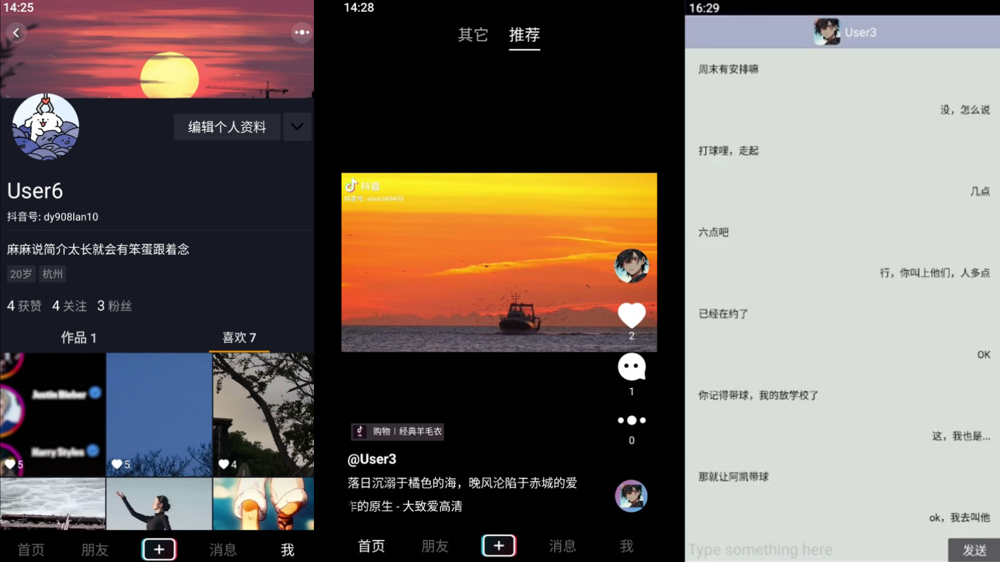
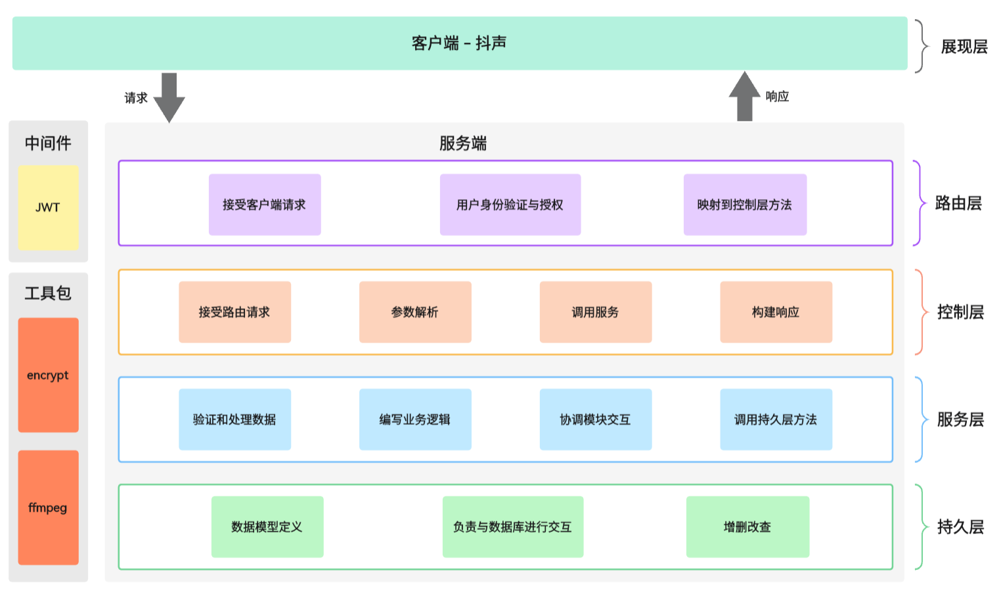
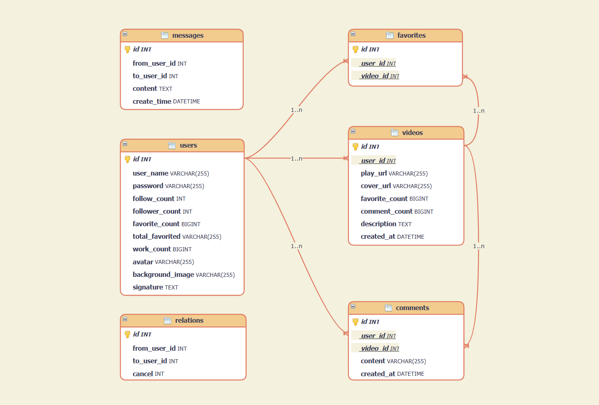

<!-- LOGO -->
<div align="center">

<a href="https://github.com/zheng-yi-yi/SimpleDouyin/">
  
</a>

</br>

<!-- shields -->


<h3>
  <a href="#🚀-feature-module">Feature module</a>
  <span> | </span>
  <a href="https://github.com/zheng-yi-yi/SimpleDouyin/blob/dev/asset/document/Database_Design.md">Database design</a>
  <span> | </span>
  <a href="https://github.com/zheng-yi-yi/SimpleDouyin/blob/dev/asset/document/Layered_Architecture.md">Architecture</a>
  <span> | </span>
  <a href="#⌨️-how-to-use">How to use</a>
</h3>

</div>

# ☁️ Introduction

`SimpleDouyin`，一个基于 `Golang` 编写的短视频分享平台后端服务，以促进用户互动和内容分享，是第六届字节跳动青训营后端大项目的实现，涵盖了用户、视频、喜欢、关系、评论和聊天等功能模块。

<div align="center">

<a href="https://github.com/zheng-yi-yi/SimpleDouyin/">
  
</a>

</div>

---

## 🌟 Technology

<div align="center">

<table style="text-align: center;">
  <tr>
    <th>Technology</th>
    <th style="text-align: center;">Description</th>
  </tr>
  <tr>
    <td><a href="https://go.dev/doc/" target="_blank">Go</a></td>
    <td>静态强类型、编译型、并发型，并具有垃圾回收功能的编程语言</td>
  </tr>
  <tr>
    <td><a href="https://gin-gonic.com/docs/" target="_blank">Gin</a></td>
    <td>构建 Web 服务和 API，处理 HTTP 请求和响应</td>
  </tr>
  <tr>
    <td><a href="https://dev.mysql.com/doc/" target="_blank">MySQL</a></td>
    <td>存储各数据模块，以支持数据的持久化存储和管理</td>
  </tr>
  <tr>
    <td><a href="https://gorm.io/" target="_blank">GORM</a></td>
    <td>用于进行数据库查询、插入、更新和删除操作</td>
  </tr>
  <tr>
    <td><a href="https://pkg.go.dev/github.com/golang-jwt/jwt/v5" target="_blank">golang-jwt</a></td>
    <td>实现 JWT 鉴权，用于用户身份验证和授权</td>
  </tr>
  <tr>
    <td><a href="https://pkg.go.dev/golang.org/x/crypto/bcrypt" target="_blank">bcrypt</a></td>
    <td>对用户密码进行加密和验证，确保密码存储的安全性</td>
  </tr>
  <tr>
    <td><a href="https://www.ffmpeg.org/" target="_blank">Ffmpeg</a></td>
    <td>多媒体处理工具，用于视频文件的截图操作，生成封面</td>
  </tr>
  <tr>
    <td><a href="https://github.com/spf13/viper" target="_blank">viper</a></td>
    <td>用于加载数据库连接信息、密钥、服务器端口等配置参数</td>
  </tr>
  <tr>
    <td><a href="https://github.com/gavv/httpexpect/" target="_blank">httpexpect</a></td>
    <td>编写 HTTP 请求和响应的测试用例，验证各个 API 端点的正确性和一致性</td>
  </tr>
</table>

</div>

---

# 🚀 Feature module

本项目划分为六个模块，功能描述如下：

1. ✅用户模块
   - 用户注册：通过提供用户名和密码进行用户注册
   - 用户登录：已注册用户可以通过用户名和密码进行登录
   - 用户信息：获取登录用户的个人信息，如头像、昵称，关注数和粉丝数等
2. ✅视频模块
   - 视频浏览：不限制登录状态，用户可以刷视频
   - 视频上传：登录用户可以上传短视频，包括标题和视频文件
   - 发布列表：获取用户所有作品
3. ✅喜欢模块
   - 赞操作：用户可以对视频进行点赞操作或取消点赞
   - 喜欢列表：获取登录用户所有点赞视频
4. ✅关系模块
   - 关系操作：登录用户对其他用户进行关注操作或取关
   - 关注列表：获取登录用户的关注列表
   - 粉丝列表：获取登录用户的粉丝列表
   - 好友列表：获取所有关注登录用户的粉丝列表
5. ✅评论模块
   - 评论操作：登录用户可以对视频进行评论
   - 评论列表：查看视频的所有评论
6. ✅消息模块
   - 聊天记录：获取当前登录用户和指定用户的聊天记录
   - 发送消息：登录用户将消息发送给好友

---

# 💻 Layered_Architecture

本项目的主体结构如下：

```bash
SimpleDouyin/
├── config/         # 项目配置
├── setup/          # 项目初始化
├── controllers/    # 处理 HTTP 请求的控制器
├── services/       # 存放系统的业务逻辑代码
├── models/         # 存放数据模型以及与数据库交互的操作
├── public/         # 存放静态资源文件，包括视频文件和封面等
├── middlewares/    # 自定义中间件函数，用于在路由处理前后执行操作
├── utils/          # 工具函数：包括 encrypt加密操作和ffmpeg截图服务等
├── main.go         # 项目入口：包含 HTTP 服务器初始化和启动代码
└── router.go       # 路由层：路由定义，映射 HTTP 请求到相应的处理函数
```

可以看到，`SimpleDouyin` 项目采用分层架构，代码按照路由层、控制层、服务层和持久层来划分，这样可以有效地将不同的功能逻辑分开，利于构建一个结构清晰、模块化、可扩展且易于维护的后端应用程序。

<div align="center">
    
</div>

<br/>

具体内容可查看 [分层架构设计思路开发文档](./asset/document/Layered_Architecture.md) 。

# 🔍 Database design

`SimpleDouyin` 项目在数据存储方面需要构建以下实体表：

<div align="center">
    
</div>

具体内容可查看 [数据库设计思路开发文档](./asset/document/Database_Design.md) 。

# ⌨️ How to use

下面是一些简单的步骤，帮助你快速启动项目并在本地运行起来。

<details>
<summary> 点击查看 | 快速开始 </summary>

## 前言

首先确保本地已经配置好了 `Go` 和 `MySQL` 的开发环境，并且已成功安装了 `FFmpeg` 工具（该工具用于视频上传后的封面截图服务）。

> 本项目是在 `Windows` 系统上进行开发的，有关 `Go` 开发环境的具体配置步骤可以自行查询。关于 `FFmpeg` 工具的安装，请[访问 FFmpeg 官方网站](https://ffmpeg.org/) 自行下载安装。
## 克隆项目

```git
git clone https://github.com/zheng-yi-yi/SimpleDouyin.git
```

## 进入项目根目录

```bash
cd SimpleDouyin
```

## 安装依赖

使用以下命令安装项目所需的依赖：

```go
go mod tidy
```

## 修改配置

打开项目根目录下的 `config.yaml` 文件:

- 填入： `username`
- 填入：`password` 

接着修改 `config` 目录下的 `config.go` 文件:

- 将 `LOCAL_IP_ADDRESS` 的值修改为本机 `IP` 地址。

<details>

<summary> 如何查询本机 IP 地址 | 点击查看 </summary>

</br>

> 
> 1. 按 `Win` + `R` 打开运行窗口
> 2. 输入 `cmd` 打开命令行窗口
> 3. 输入 `ipconfig` 并回车，即可查到本机 IP 地址。
> 4. 比如：`IPv4 地址 . . . . . . . . . . . . : 192.168.1.7`

</br>
</details>

## 添加数据库

使用以下命令创建数据库 `douyin`。

```sql
CREATE DATABASE douyin
```

## 编译运行

编译项目：

```shell
go build
```

编译后会生成一个可执行文件，运行：

```
./SimpleDouyin.exe
```

## APP

最后，在极简抖音 App 中，双击右下方的 **“我”** 打开高级设置 ，填入服务地址（本机地址），点击**保存并重启**后即可看见效果。

> 比如本机 IP 地址为 `192.168.1.7`，那么在高级设置中就填入 `http://192.168.1.7:8080/`

</details>

---

# 🎉 鸣谢

[字节跳动 | 青训营](https://youthcamp.bytedance.com/)

<div align="center">
  <a href="https://youthcamp.bytedance.com/">
    
  </a>
</div>