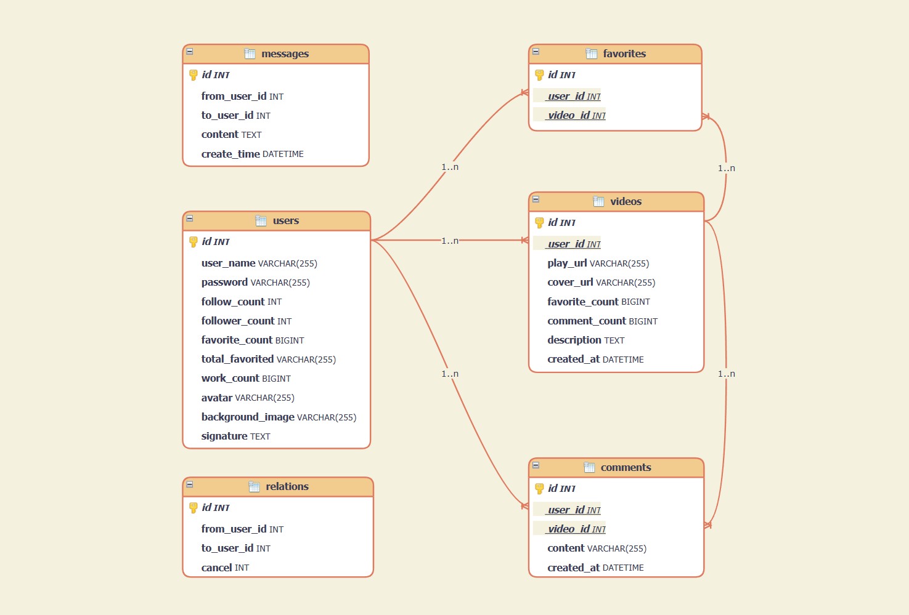

# Database design

## ER图

`SimpleDouyin` 项目在数据存储方面需要构建以下实体表：

<div align="center">
    
</div>

---

## 实体间的关系

- **一对多关系：**
  - 用户 - 视频：每个用户可以上传多个短视频，形成一对多的关系。
  - 用户 - 点赞：每个用户可以给多个视频点赞，形成一对多的关系。
  - 用户 - 评论：每个用户可以对多个视频进行评论，形成一对多的关系。
  - 视频 - 评论：每个视频可以拥有多个评论，形成一对多的关系。
  - 视频 - 点赞：每个视频可以拥有多个赞，形成一对多关系
- **多对多关系：**
  - 用户 - 用户关注操作：用户之间可以相互关注，构成多对多的关系，形成关注列表、粉丝列表和好友列表。
  - 用户 - 用户发送消息：一个用户可以发送消息给多个其他用户，同时一个用户也可以接收来自多个其他用户的消息。形成多对多关系。

---


## 实体表的描述

<div align="center">

<table>
  <tr>
    <th style="text-align: center;">实体表</th>
    <th style="text-align: center;">描述</th>
  </tr>
  <tr>
    <td style="text-align: center;"><code>User</code></td>
    <td>用户信息，包括用户名、密码、关注数、作品数等</td>
  </tr>
  <tr>
    <td style="text-align: center;"><code>Video</code></td>
    <td>视频信息，包括作者ID、视频播放地址、视频获赞数量等</td>
  </tr>
  <tr>
    <td style="text-align: center;"><code>Favorite</code></td>
    <td>点赞信息，包括用户ID，视频ID，点赞状态等。</td>
  </tr>
  <tr>
    <td style="text-align: center;"><code>Relation</code></td>
    <td>关注信息，包括关注者ID，被关注者ID，关注是否取消等</td>
  </tr>
  <tr>
    <td style="text-align: center;"><code>Comment</code></td>
    <td>评论信息，包括评论内容和发布时间，与用户和视频关联。</td>
  </tr>
  <tr>
    <td style="text-align: center;"><code>Message</code></td>
    <td>聊天信息，包括发送者、接收者、消息内容和发送时间。</td>
  </tr>
</table>

</div>

---

#  GORM 库的使用


## models包下的模型定义

以下是每个实体表的设计，包含了各个 `GORM` 模型定义。

**User**：

```go
// 用户表
type User struct {
	ID              uint   `gorm:"primarykey"`
	UserName        string `gorm:"not null; comment:用户名;   type:VARCHAR(255)"`
	PassWord        string `gorm:"not null; comment:密码;     type:VARCHAR(255)"`
	FollowCount     int    `gorm:"not null; comment:关注总数; type:INT"`
	FollowerCount   int    `gorm:"not null; comment:粉丝总数; type:INT"`
	FavoriteCount   int64  `gorm:"not null; comment:喜欢数;   type:BIGINT"`
	TotalFavorited  string `gorm:"not null; comment:获赞数量; type:VARCHAR(255)"`
	WorkCount       int64  `gorm:"not null; comment:作品数;   type:BIGINT"`
	Avatar          string `gorm:"not null; comment:用户头像; type:VARCHAR(255)"`
	BackgroundImage string `gorm:"not null; comment:顶部图;   type:VARCHAR(255)"`
	Signature       string `gorm:"not null; comment:个人简介; type:TEXT"`
	// 定义外键关系
	Video   []Video   `gorm:"foreignKey:UserId; references:ID; comment:视频信息"`
	Comment []Comment `gorm:"foreignKey:UserId; references:ID; comment:评论信息"`
}
```

**Video**：

```go
// Video, 视频表
type Video struct {
	ID            uint      `gorm:"primarykey"`
	UserId        uint      `gorm:"not null; comment:作者ID           type:INT"`
	PlayUrl       string    `gorm:"not null; comment:视频播放地址;    type:VARCHAR(255)"`
	CoverUrl      string    `gorm:"not null; comment:视频封面地址;    type:VARCHAR(255)"`
	FavoriteCount int64     `gorm:"not null; comment:点赞数量;        type:BIGINT"`
	CommentCount  int64     `gorm:"not null; comment:视频的评论总数;  type:BIGINT"`
	Description   string    `gorm:"not null; comment:视频描述;        type:TEXT"`
	CreatedAt     time.Time `gorm:"not null; comment:视频发布日期;    type:DATETIME"`
	// 定义外键关系
	User User `gorm:"foreignKey:UserId; references:ID; comment:作者信息"`
}
```

**Favorite**：

```go
// Favorite, 点赞表
type Favorite struct {
	ID      uint `gorm:"primarykey"`
	UserId  uint `gorm:"not null; comment:用户ID;  type:INT"`
	VideoId uint `gorm:"not null; comment:视频ID;  type:INT"`
	// 定义外键关系
	User  User  `gorm:"foreignKey:UserId;  references:ID; comment:点赞用户的信息"`
	Video Video `gorm:"foreignKey:VideoId; references:ID; comment:点赞视频的信息"`
}
```

**Relation**：

```go
// Relation, 关注关系表
type Relation struct {
	ID         uint `gorm:"primarykey"`
	FromUserId uint `gorm:"not null; comment: 用户id;                  type:INT"`
	ToUserId   uint `gorm:"not null; comment: 关注的用户;               type:INT"`
	Cancel     uint `gorm:"not null; comment: 默认关注为0，取消关注为1;  type:INT"`
}
```

**Comment**：

```go
//  Comment. 评论表
type Comment struct {
	ID        uint      `gorm:"primarykey; comment:评论id"`
	UserId    uint      `gorm:"not null;   comment:发布评论的用户id;  type:INT"`
	VideoId   uint      `gorm:"not null;   comment:评论所属视频id;    type:INT"`
	Content   string    `gorm:"not null;   comment:评论内容;          type:VARCHAR(255)"`
	CreatedAt time.Time `gorm:"not null;   comment:评论发布日期;      type:DATETIME"`
	// 定义外键关系
	User  User  `gorm:"foreignKey:UserId; references:ID; comment:评论所属用户"`
	Video Video `gorm:"foreignKey:VideoId; references:ID; comment:评论所属视频"`
}
```

**Message**：

```go
// Message, 消息表
type Message struct {
	ID         uint      `gorm:"primaryKey comment:消息id"`
	FromUserID uint      `gorm:"not null   comment:消息发送者id; type:INT"`
	ToUserID   uint      `gorm:"not null   comment:消息接收者id; type:INT"`
	Content    string    `gorm:"not null   comment:消息内容;     type:TEXT"`
	CreateTime time.Time `gorm:"not null   comment:消息发送时间; type:DATETIME"`
}
```

---

## AutoMigrate - 自动建表或更新表结构

本项目使用了 `GORM` 库进行自动创建数据库表，需要使用到 `AutoMigrate` 函数。

首先简单介绍一下 `AutoMigrate` 函数：

`AutoMigrate` 函数是 `GORM` 中的一个重要功能，用于自动创建数据库表和更新表结构以匹配模型定义的更改。该函数通常在应用程序的启动时使用，以确保数据库表的结构与模型一致。函数签名如下：

```go
func (db *DB) AutoMigrate(dst ...interface{}) error
```

参数说明：

- `db`: `AutoMigrate` 方法是 GORM 的 `*gorm.DB` 类型的方法，表示数据库连接对象。
- `dst`: 一个或多个要进行自动迁移的模型（结构体）的变量或指针。你可以传递多个模型作为参数，`AutoMigrate` 会依次创建或更新这些模型对应的数据库表。

举个例子：

```go
import (
    "gorm.io/driver/mysql"
    "gorm.io/gorm"
)

func main() {

    // 数据库连接
    dsn := "user:password@tcp(database-host:port)/database-name?charset=utf8mb4&parseTime=True&loc=Local"
    db, err := gorm.Open(mysql.Open(dsn), &gorm.Config{})
    if err != nil {
        panic("无法连接到数据库")
    }

    // 自动建表或更新表结构
    db.AutoMigrate(&User{})
    db.AutoMigrate(&Video{})
    db.AutoMigrate(&Favorite{})
    db.AutoMigrate(&Relation{})
    db.AutoMigrate(&Comment{})
    db.AutoMigrate(&Message{})

    // ......
}
```

在上述示例中，我们首先连接到数据库，然后使用 `AutoMigrate` 函数传递了一系列模型（`User`、`Video` 等），这些模型的表结构会被创建或更新以匹配模型定义。

---

## dao.go

在 `models` 包下的`dao.go` 定义了基本的数据库操作函数，用于执行与用户、视频、点赞、评论等相关的数据库操作。它们可以实现各种与数据库交互的功能，如判断用户关注状态、点赞状态，增加或减少统计数据等。根据你的应用需求，你可以在这些基础函数的基础上进一步构建更复杂的功能和业务逻辑。

---

## 注意事项

- 使用 `AutoMigrate` 时，请确保传递的模型结构与数据库表的当前状态匹配。如果你已经有了一个具有数据的数据库表，不要轻易更改字段名称或类型，以免造成数据丢失或不兼容。
- 如果你的应用程序在生产环境中使用，建议在升级数据库表结构时小心谨慎，并备份重要数据。
- `AutoMigrate` 只会自动创建或更新表结构，不会执行其他数据迁移任务，如数据导入、数据转换等。对于复杂的数据库迁移需求，你可能需要使用其他数据库迁移工具，如 `gormigrate`。

---

## 参考资料

- [GORM官方文档](https://gorm.io/docs/) - `GORM` 官方文档提供了详细的使用指南、示例和 `API` 文档。
- [GORM GitHub仓库](https://github.com/go-gorm/gorm) - `GORM` 的 `GitHub` 仓库包含了源代码、问题跟踪和社区讨论，可以查找最新的更新和问题解决方案。