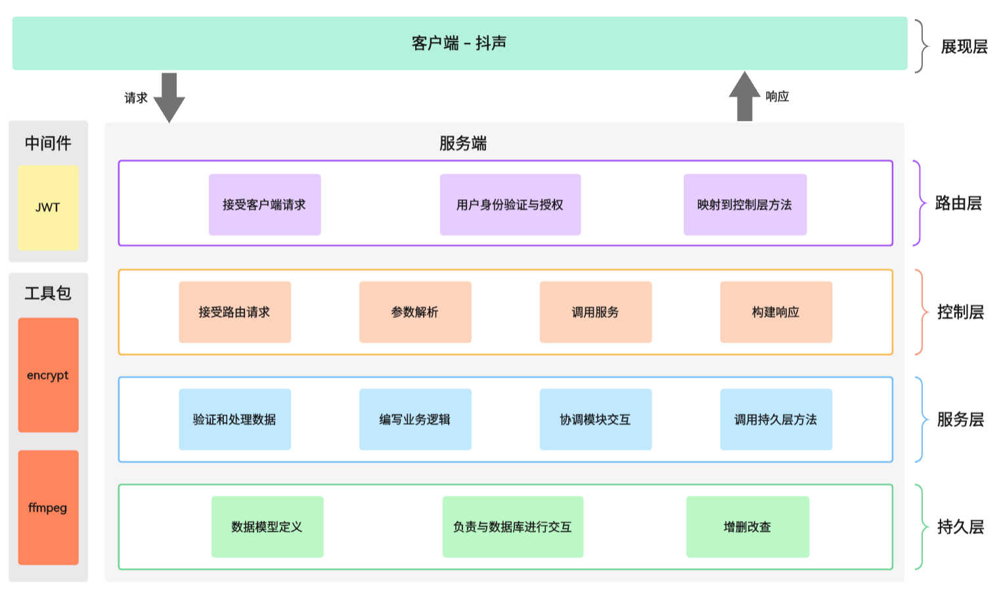

# Layered_Architecture

本项目的主体结构如下：

```bash
SimpleDouyin/
├── config/         # 项目配置
├── setup/          # 项目初始化
├── controllers/    # 处理 HTTP 请求的控制器
├── services/       # 存放系统的业务逻辑代码
├── models/         # 存放数据模型以及与数据库交互的操作
├── public/         # 存放静态资源文件，包括视频文件和封面等
├── middlewares/    # 自定义中间件函数，用于在路由处理前后执行操作
├── utils/          # 工具函数：包括 encrypt加密操作和ffmpeg截图服务等
├── main.go         # 项目入口：包含 HTTP 服务器初始化和启动代码
└── router.go       # 路由层：路由定义，映射 HTTP 请求到相应的处理函数
```

可以看到，`SimpleDouyin` 项目采用分层架构，代码按照路由层、控制层、服务层和持久层来划分，这样可以有效地将不同的功能逻辑分开，利于构建一个结构清晰、模块化、可扩展且易于维护的后端应用程序。

<div align="center">
    
</div>

<br/>

下面进行简单的分析与记录。

---

## Router

**路由层**，负责路由的初始化以及定义应用程序的不同 `API` 端点，接收客户端请求，并分发映射到控制器方法中，起到了路由请求和处理方法之间的桥梁作用。

> 这一层主要将不同的 HTTP 请求（GET、POST）映射到相应的控制器进行处理。

主体代码如下：

```go
// route initialization function
func initRouter(r *gin.Engine) {
	// basicSetup
	r.Static("/public", "./public")
	r.StaticFile("/favicon.ico", "./public/favicon.ico")
	apiRouter := r.Group("/douyin")
	// fundamental features：
	apiRouter.GET("/feed/", video.Feed)                                                 //  视频流
	apiRouter.POST("/user/register/", user.Register)                                    // 用户注册
	apiRouter.POST("/user/login/", user.Login)                                          // 用户登录
	apiRouter.GET("/user/", middlewares.Auth(), user.UserInfo)                          // 用户信息
	apiRouter.POST("/publish/action/", middlewares.UserPublishAuth(), video.Publish)    // 视频投稿
	apiRouter.GET("/publish/list/", middlewares.Auth(), video.PublishList)              // 发布列表
	// Extended Feature 1: Interactivity
	apiRouter.POST("/favorite/action/", middlewares.Auth(), favorite.FavoriteAction)    // 点赞操作
	apiRouter.GET("/favorite/list/", middlewares.Auth(), favorite.FavoriteList)         // 喜欢列表
	apiRouter.POST("/comment/action/", middlewares.Auth(), comment.CommentAction)       // 评论操作
	apiRouter.GET("/comment/list/", middlewares.Auth(), comment.CommentList)            // 评论列表
	// Extended Feature 2: Social
	apiRouter.POST("/relation/action/", middlewares.Auth(), relation.RelationAction)    // 关注操作
	apiRouter.GET("/relation/follow/list/", middlewares.Auth(), relation.FollowList)    // 关注列表
	apiRouter.GET("/relation/follower/list/", middlewares.Auth(), relation.FollowerList)// 粉丝列表
	apiRouter.GET("/relation/friend/list/", middlewares.Auth(), relation.FriendList)    // 好友列表
	apiRouter.POST("/message/action/", middlewares.Auth(), message.MessageAction)       // 发送消息
	apiRouter.GET("/message/chat/", middlewares.Auth(), message.MessageChat)            // 聊天记录
}
```

上述代码位于本项目根目录下的 `router.go` 文件中，`initRouter` 是一个基于 `Gin` 框架的路由初始化函数，它用于定义 `API` 端点和路由处理函数。它接受一个 `gin.Engine` 实例 `r` 作为参数。

> `gin.Engine` 是 `Gin` 框架的核心，用于管理 `HTTP` 路由和中间件。

我们来记录一下：

```go
r.Static("/public", "./public")
r.StaticFile("/favicon.ico", "./public/favicon.ico")
```

这两行代码用于设置静态文件服务，`Static` 方法用于将指定目录下的文件提供给客户端，`StaticFile` 方法用于提供一个特定文件。

```go
apiRouter := r.Group("/douyin")
```

这行代码定义了一个名为 `/douyin` 的路由组，将所有的 `API` 端点都添加到这个组中。这有助于组织和命名相关的 `API` 端点，使代码更具结构性。

```go
apiRouter.GET("/feed/", video.Feed)
// ...
```

接着，我们使用 `GET` 和 `POST` 方法定义了不同的 `API` 端点，以及它们对应的处理函数。

比如， `apiRouter.GET("/feed/", video.Feed)` 定义了一个 `GET` 请求的 `API` 端点 `/douyin/feed/`，并将其与 `video.Feed` 函数关联。这表示当客户端发出 `/douyin/feed/` 的 `GET` 请求时，将调用 `video.Feed` 处理函数来处理请求。

其他 `API` 端点的定义和关联方式与上述相似，每个端点都有对应的处理函数。

```go
apiRouter.GET("/user/", middlewares.Auth(), user.UserInfo)
// ...
apiRouter.POST("/publish/action/", middlewares.UserPublishAuth(), video.Publish)
```

可以发现，这里我们使用了 `middlewares.Auth()` 和 `middlewares.UserPublishAuth()` 中间件函数，这是为了确保某些 `API` 端点的身份验证和授权。具体可查看项目根目录中 `middlewares` 包下的 `jwt.go` 文件。

> 中间件是一种在处理请求之前或之后执行的函数，用于执行常见的操作，例如身份验证、日志记录等。详细可查看 [JWT设计思路](Middleware.md)

---

## Controllers

**控制层**，接收来自路由的请求，并根据请求类型和参数来调用相应业务逻辑层中的方法，同时进行相应的错误处理和构建合适的 HTTP 响应。

> 这一层将客户端请求与底层的业务逻辑隔离开来，提供统一的接口。

控制层的目录结构如下：

```bash
controllers/
    ├── user/
    │   ├── register.go       # 处理用户注册请求
    │   ├── login.go          # 处理用户登录请求
    │   └── user.go           # 处理获取用户信息请求
    ├── video/
    │   ├── feed.go           # 处理获取视频流（feed）的请求
    │   ├── publish.go        # 处理用户发布视频请求
    │   └── publishList.go    # 处理获取用户发布视频列表请求
    ├── favorite/
    │   ├── favoriteAction.go # 处理赞操作（点赞或取消赞）请求
    │   └── favoriteList.go   # 处理获取用户喜欢列表请求
    ├── comment/
    │   ├── commentAction.go  # 处理评论操作（添加评论或删除评论）请求
    │   └── commentlist.go    # 处理获取评论列表请求
    ├── relation/
    │   ├── relationAction.go # 处理关系操作（关注或取关）请求
    │   ├── followlist.go     # 处理获取用户关注列表请求
    │   ├── followerList.go   # 处理获取用户粉丝列表请求
    │   └── friendList.go     # 处理获取用户好友列表请求
    ├── message/
    │   ├── messageAction.go  # 处理发送消息请求
    │   └── messageChat.go    # 处理获取聊天记录请求
    └── response/ 
        ├── shared_resp.go    # 通用响应结构
        ├── user_resp.go      # 与用户模块相关的响应结构
        ├── video_resp.go     # 与视频模块相关的响应结构
        ├── comment_resp.go   # 与评论模块相关的响应结构
        ├── favorite_resp.go  # 与喜欢模块相关的响应结构
        ├── relation_resp.go  # 与关系模块相关的响应结构
        └── message_resp.go   # 与消息模块相关的响应结构
```

可以看到，这一层的主要目的是处理客户端的请求，并与底层的业务逻辑层隔离开来，提供统一的接口。其中主要任务包括：

1. 解析请求参数
2. 调用服务层方法
3. 处理相关错误
4. 构建HTTP响应

同时，我根据不同的模块，将代码组织成多个子目录，算是提高了代码的可维护性。

另外，控制层定义了响应结构体，用于构建HTTP响应的 JSON 数据，我将这部分代码都放在了 `controllers/response` 包下，也便于管理。

> 响应结构体包括了状态码、状态消息以及相关的数据，具体可查看源码。

以上便是简单的控制层实现，包含了多个功能模块，每个模块负责不同的业务逻辑，但都遵循类似的设计模式和实现原则。


## Services

**服务层**，处理应用程序功能的地方。这一层负责验证和处理数据，进行业务逻辑的编写，协调不同模块之间的交互，确保整个应用程序按预期工作。

> 这一层可以调用数据库访问层的方法来读取或写入数据。

该层的目录结构如下：

```bash
Services/
    ├── comment_service.go      # 创建评论、获取视频的评论列表、根据评论ID获取评论等
    ├── favorite_service.go     # 判断用户是否点赞、点赞和取消点赞操作、获取用户点赞列表等
    ├── message_service.go      # 添加消息和获取消息列表
    ├── relation_service.go     # 关注用户、取关用户、获取关注列表等
    ├── user_service.go         # 用户注册与登录、获取用户信息等
    └── video_service.go        # 获取视频Feed、获取用户发布的视频列表等
```

这一层代码主要是用于处理不同模块的业务逻辑，包括评论、点赞、消息、用户关系、用户注册和登录、视频处理等。


## Models

**持久层**，这一层定义了数据模型（struct）、并处理与数据库的交互，包括创建、读取、更新和删除数据，将业务逻辑层与数据库之间的操作隔离开来。

> 这一层主要负责与数据库进行交互

持久层的分析与记录可查看 [数据库设计思路与实现](Database_Design.md) 。